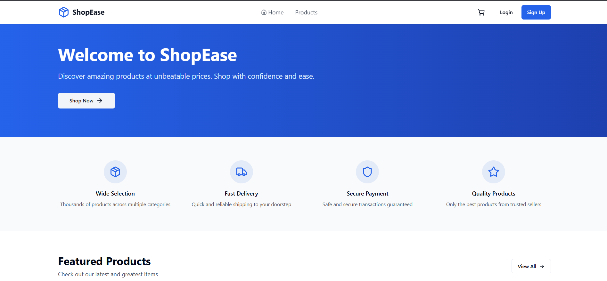
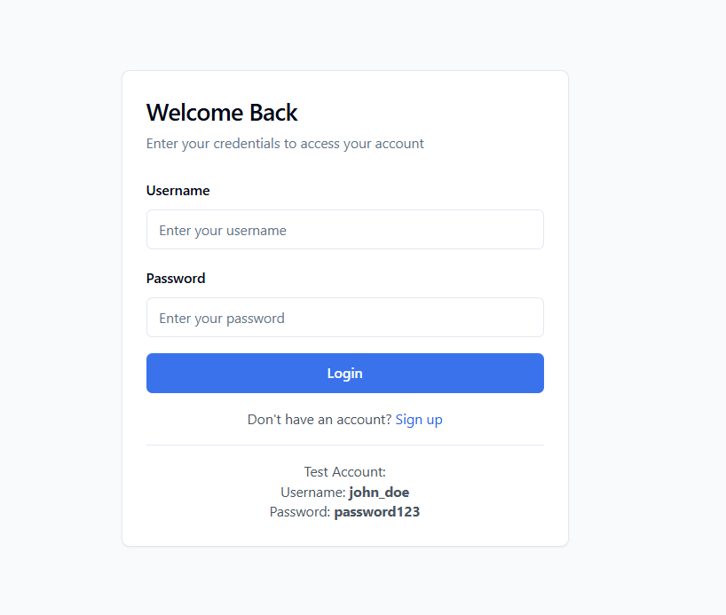
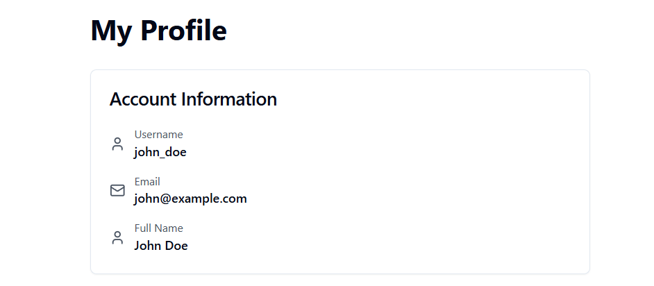

# 🛍️ ShopEase - Modern E-Commerce Platform

A full-stack e-commerce web application built with Django REST Framework and React. This project demonstrates my ability to build production-ready applications with secure authentication, real-time inventory management, and a polished user experience.



## 🎯 Project Overview

ShopEase is a complete e-commerce solution where users can browse products, manage their shopping cart, and place orders. I built this to showcase my skills in full-stack development, RESTful API design, and modern frontend frameworks.

**Live Demo**: [Coming Soon]
**Backend API**: Built with Django REST Framework
**Frontend**: React + Tailwind CSS

---

## ✨ Key Features

### For Customers

- **Browse Products** - View 40+ products across 8 different categories without needing to login
- **Smart Search** - Find products quickly with real-time search and category filters
- **Shopping Cart** - Add products to cart with automatic stock validation
- **Secure Checkout** - Place orders with address management and order tracking
- **Order History** - View all past orders with detailed breakdowns
- **Profile Management** - Update contact information and shipping addresses

### For Developers

- **JWT Authentication** - Secure token-based auth with automatic refresh
- **Protected Routes** - Client-side route protection for authenticated pages
- **Stock Management** - Automatic inventory updates when orders are placed
- **Order Cancellation** - Restores product stock when orders are cancelled
- **Responsive Design** - Works perfectly on desktop, tablet, and mobile
- **Error Handling** - Proper validation and user-friendly error messages

---

## 🛠️ Tech Stack

### Backend

- **Django 5.2** - Python web framework
- **Django REST Framework** - RESTful API development
- **Simple JWT** - JSON Web Token authentication
- **SQLite** - Database (easily switchable to PostgreSQL)
- **Django CORS Headers** - Handle cross-origin requests

### Frontend

- **React 18** - UI library
- **Vite** - Build tool and dev server
- **React Router** - Client-side routing
- **Axios** - HTTP client with interceptors
- **Tailwind CSS** - Utility-first CSS framework
- **Shadcn UI** - Beautiful, accessible components
- **Lucide React** - Icon library
- **Sonner** - Toast notifications
- **React Hook Form** - Form management

---

## 📸 Screenshots

### Home Page

Browse products with a clean, modern interface. Users can explore the catalog without creating an account.


### Login Page

Simple and secure authentication. JWT tokens keep sessions safe while providing a seamless experience.



### User Profile

Manage personal information and shipping addresses. Everything updates in real-time.



---

## 🚀 Getting Started

### Prerequisites

- Python 3.10+
- Node.js 18+
- pip (Python package manager)
- npm (Node package manager)

### Backend Setup

1. **Clone the repository**

   ```bash
   git clone https://github.com/shadinbyte/shopease.git
   cd shopease
   ```

2. **Set up the backend**

   ```bash
   cd shopease-backend
   python -m venv venv

   # Activate virtual environment
   # On Windows:
   venv\Scripts\activate
   # On Mac/Linux:
   source venv/bin/activate

   # Install dependencies
   pip install -r requirements.txt
   ```

3. **Configure environment variables**

   Create a `.env` file in the backend directory:

   ```env
   SECRET_KEY=your-secret-key-here
   DEBUG=True
   ALLOWED_HOSTS=localhost,127.0.0.1
   ```

4. **Set up the database**

   ```bash
   python manage.py migrate
   python manage.py createsuperuser
   ```

5. **Populate sample data** (optional but recommended)

   ```bash
   python scripts/populate_data.py
   ```

6. **Start the backend server**

   ```bash
   python manage.py runserver
   ```

   Backend will be running at `http://127.0.0.1:8000`

### Frontend Setup

1. **Navigate to frontend directory**

   ```bash
   cd shopease-frontend
   ```

2. **Install dependencies**

   ```bash
   npm install
   ```

3. **Configure environment**

   Create a `.env` file in the frontend directory:

   ```env
   VITE_API_URL=http://127.0.0.1:8000/api
   ```

4. **Start the development server**

   ```bash
   npm run dev
   ```

   Frontend will be running at `http://localhost:5173`

### Test Credentials

After running the populate script, you can login with:

- **Username**: `john_doe`
- **Password**: `password123`

Or create your own account by clicking "Sign Up"

---

## 📁 Project Structure

```
shopease/
├── Backend/                   # Django backend
│   ├── shopease/              # Project settings
│   ├── shop/                  # Main app
│   │   ├── models.py          # Database models
│   │   ├── serializers.py     # DRF serializers
│   │   ├── views.py           # API endpoints
│   │   └── urls.py            # URL routing
│   ├── scripts/               # Utility scripts
│   └── requirements.txt       # Python dependencies
│
└── Frontend/                  # React frontend
    ├── src/
    │   ├── components/        # Reusable components
    │   ├── pages/             # Page components
    │   ├── services/          # API integration
    │   ├── context/           # React Context (state)
    │   └── utils/             # Helper functions
    └── package.json           # Node dependencies
```

---

## 🔑 API Endpoints

### Authentication

- `POST /api/auth/register/` - Create new account
- `POST /api/auth/login/` - Login and get JWT tokens
- `POST /api/auth/token/refresh/` - Refresh access token
- `POST /api/auth/logout/` - Logout (blacklist token)
- `GET /api/auth/user/` - Get current user info

### Products

- `GET /api/products/` - List all products (public)
- `GET /api/products/{id}/` - Product details (public)
- `GET /api/products/?search=query` - Search products
- `GET /api/products/?category=id` - Filter by category

### Categories

- `GET /api/categories/` - List all categories (public)
- `GET /api/categories/{id}/products/` - Products in category

### Orders (Protected)

- `GET /api/orders/` - User's order history
- `POST /api/orders/` - Create new order
- `GET /api/orders/{id}/` - Order details
- `POST /api/orders/{id}/cancel/` - Cancel order

### Customer Profile (Protected)

- `GET /api/customers/profile/` - Get user profile
- `PATCH /api/customers/profile/` - Update profile

### Analytics (Protected)

- `GET /api/analytics/dashboard/` - Overall statistics
- `GET /api/analytics/top-products/` - Best sellers
- `GET /api/analytics/top-customers/` - Top spenders

---

## 🧪 Testing

### Backend Tests

```bash
cd shopease-backend
python manage.py test
```

### Test with Postman

I've included a Postman collection in the repository. Import `ShopEase.postman_collection.json` to test all endpoints.

### Frontend Development

```bash
cd shopease-frontend
npm run dev
```

---

## 💡 What I Learned

Building ShopEase taught me a lot about full-stack development:

- **API Design**: Creating RESTful endpoints that are intuitive and follow best practices
- **Authentication**: Implementing JWT tokens with automatic refresh for seamless user experience
- **State Management**: Using React Context effectively without overcomplicating things
- **Error Handling**: Providing helpful error messages instead of cryptic technical jargon
- **Security**: Protecting routes, validating inputs, and preventing common vulnerabilities
- **User Experience**: Building interfaces that feel natural and don't require instructions

The biggest challenge was managing the shopping cart state and synchronizing it with backend inventory. I solved this by implementing optimistic updates with rollback on failure.

---

## 🚧 Future Enhancements

I have plans to expand ShopEase with:

- [ ] Payment gateway integration (Stripe/PayPal)
- [ ] Email notifications for order confirmations
- [ ] Product reviews and ratings
- [ ] Wishlist functionality
- [ ] Admin dashboard for managing products
- [ ] Advanced search with filters (price range, ratings)
- [ ] Order tracking with shipping updates
- [ ] Social authentication (Google, Facebook)

---

## 🤝 Contributing

This is a portfolio project, but I'm open to suggestions! If you find a bug or have an idea for improvement:

1. Open an issue describing the problem/suggestion
2. Fork the repository
3. Create a feature branch
4. Make your changes
5. Submit a pull request

---

## 📝 License

This project is open source and available under the MIT License.

---

## 🙏 Acknowledgments

- Icons by [Lucide Icons](https://lucide.dev/)
- UI components inspired by [Shadcn UI](https://ui.shadcn.com/)
- Design inspiration from modern e-commerce platforms

---

**⭐ If you find this project helpful, please give it a star!**

Built with ❤️ using Django and React
